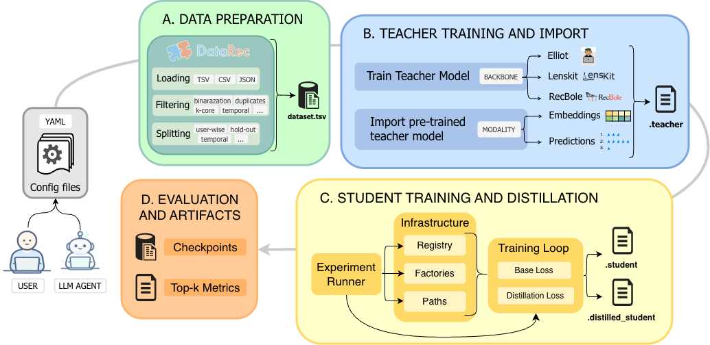

# RecDistillery Documentation



This is the official documentation for *"RecDistillery: A Framework for Teacher-Student Knowledge Distillation in Recommender Systems"*.

## Table of Contents

- [What is RecDistillery](#what-is-recdistillery)
- [Installation](#installation)
- [Modules](#modules)
- [Authors](#authors)
- [Contributors](#contributors)

## What is RecDistillery

RecDistillery is a modular framework for **teacher-student Knowledge Distillation** in Recommender Systems that provides a unified training and evaluation pipeline around PyTorch-compatible model adapters, while preserving interoperability with external recommender libraries.

## Installation

Clone this repository:

``` bash
git clone https://github.com/Mari-eng02/RecDistillery.git
```

Then, create the virtual environment with the requirements files as follows:

``` bash
python3.12 -m venv venv
source venv/bin/activate
pip install --upgrade pip setuptools wheel
pip install --upgrade "setuptools<81"
pip install ninja
pip install -r setup/requirements_cuda.txt
```

You need to have Python 3.12.0 or later installed on your system.

## Modules

- **Data Preparation:** the Python library **DataRec** ensures consistent preprocessing, splitting, and loading across datasets.
- **Teacher Training / Import:** teacher models can either be trained within the internal PyTorch-based training loop or imported 
from external sources and converted into a common representation for distillation.
- **Student Training and Distillation:** the student component is instantiated from the set of recommendation backbones natively supported by the framework and connected to a distiller module that defines how teacher knowledge is transferred.
- **Evaluation:** teacher and student models are evaluated on held-out validation and test partitions, using the standard ranking 
metrics including NDCG, Recall, Precision, and Hit Ratio. 

## Authors

- Marialuisa Pisicchio (m.pisicchio2@studenti.poliba.it)
- Alberto Carlo Maria Mancino (alberto.mancino@poliba.it)

## Contributors

- [Marialuisa Pisicchio](https://github.com/Mari-eng02)
- [Alberto Carlo Maria Mancino](https://github.com/AlbertoMancino)
- [Daniele Malitesta](https://github.com/danielemalitesta)
- [Leonardo Di Gioia](https://github.com/Leodiggio)


